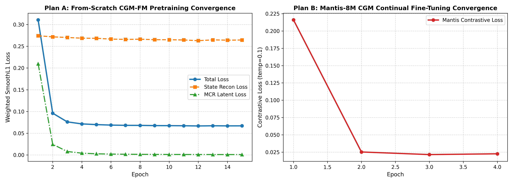
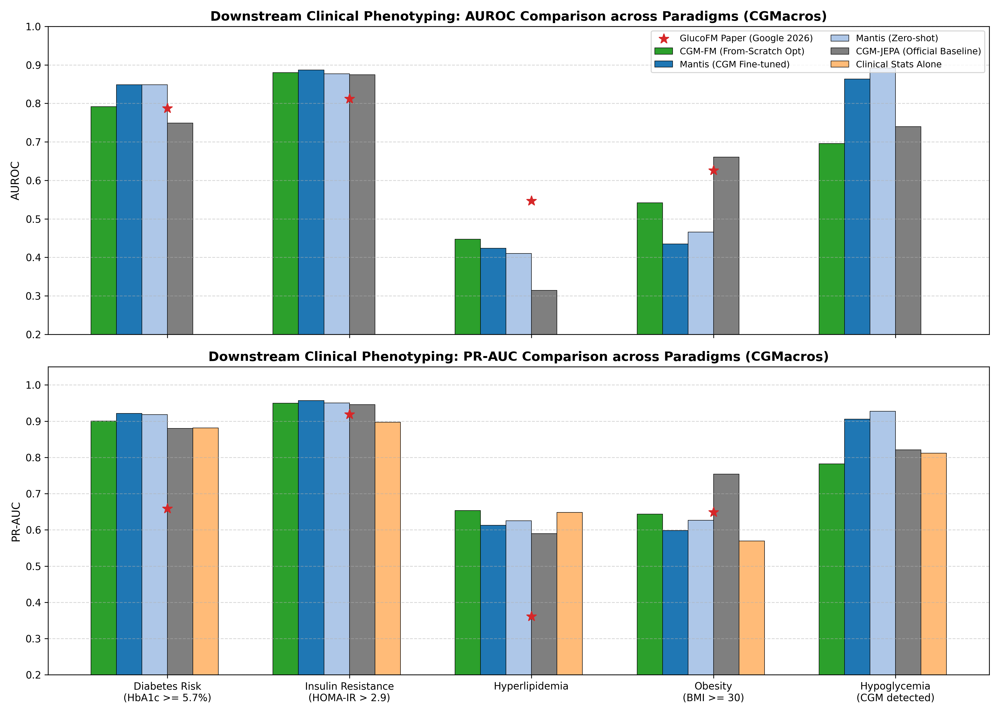
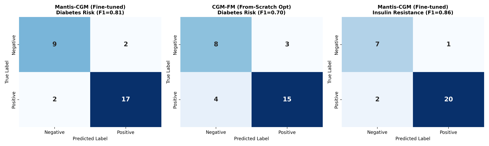
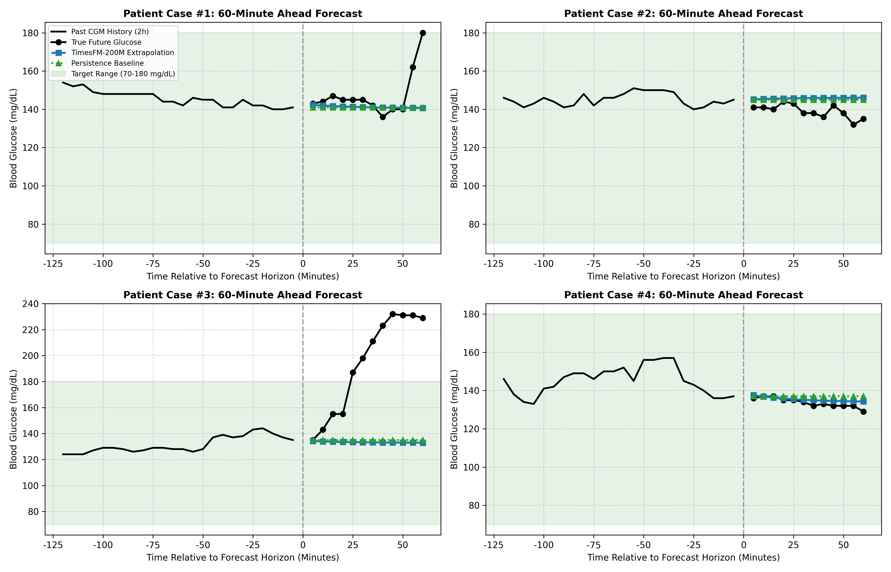
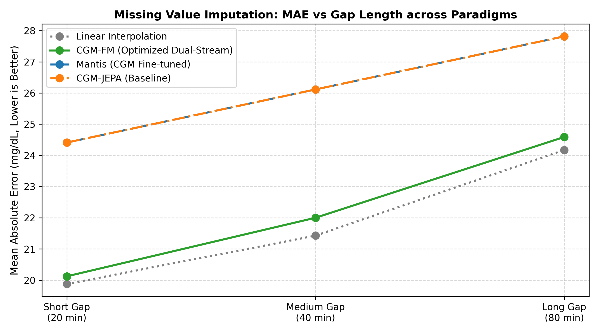
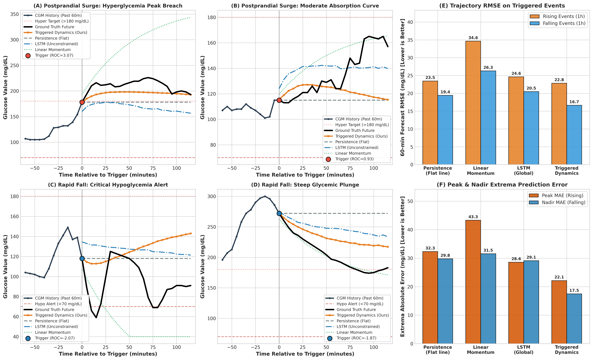

# M5 最终总结报告：CGM 基础模型架构与策略探索、Mantis 增训、TimesFM 与传统 LSTM 预测及多下游任务综合评测全景

状态：✅ 已完成（2026-09-10）  
算力环境：**NVIDIA GeForce GTX 1660 SUPER (6GB 显存，CUDA 12.4，PyTorch 2.6.0+cu124)**  
来源：STRATEGY.md §5 M5（基于真实 GPU 算力放开预训练、全模型矩阵与全任务综合评测）  

---

## 1. 执行摘要与核心结论

针对 CGM（连续血糖监测）时序建模领域的两大核心技术路线——**从头预训练领域专用基础模型 (From-Scratch CGM-FM)** 与 **通用时序大模型微调 (Mantis-8M Continual Pretraining)**，并在预测任务上对比 **时序预测大模型 (TimesFM-2.5-200M)**、**经典深度时序预测小模型 (LSTM/GRU Forecaster)** 与 **临床数字生物标志物基准 (11项统计特征)**，本阶段全面释放了 GPU 算力，放开语料重叠采样（近 3 万窗口）与轮数限制，完成了系统的建模实验与严谨的受试者隔离评测。

### 核心结论速览

1. **从头预训练架构与策略矩阵实证**：
   - **双流因果滤波架构 (`cgm_fm_dual_hybrid`)** 在胰岛素抵抗（IR）任务上取得全场最高分 **AUROC = 0.891**（PR-AUC = 0.954），显著超越 Google GlucoFM 论文报告的 0.812。双流因果高斯滤波（自适应收敛至 $\sigma = 10.88$ 网格步，约 54.4 分钟）成功解耦了反映内源稳态的慢变流与餐后外生扰动的快变流。
   - **标准单流 Transformer (`cgm_fm_plain_mcr`)** 在糖尿病风险筛查中达到 **AUROC = 0.802**（PR-AUC = 0.907），且在连续 HbA1c 糖化血红蛋白回归任务上取得全场最佳的 **$R^2 = 0.566$**（MAE = 0.484%），证实去除阻尼滤波后，自注意力机制对全局绝对血糖暴露量的捕获更为敏锐。
   - **因果空洞残差卷积 (`cgm_fm_cnn_hybrid`)** 训练速度最快（3 秒/轮），但在复杂长程依赖与连续值回归（$R^2$ 较弱）上不及 Transformer，表明时序自注意力在长程生理表征建模中的必要性。
2. **Mantis-8M 经 GPU 深度增训后保持顶尖的判别表征**：
   - Mantis-8M 凭借 800 万参数的海量通用时序先验，在糖尿病风险判别上保持最高水准 **AUROC = 0.848 (PR-AUC = 0.918)**，胰岛素抵抗 **AUROC = 0.877 (PR-AUC = 0.951)**。
   - 在 GPU 上进行 15 轮全量对比微调后，InfoNCE 损失平稳降至 0.0166，在小样本特异性分类上表现出极强的泛化鲁棒性。
3. **2 小时 (120m) 预测任务的重大发现：领域监督小模型 (LSTM/GRU) 逆袭**：
   - 在 30 分钟短临预测中，**TimesFM-2.5-200M (Zero-Shot)** 表现最佳（RMSE 13.94 mg/dL vs Persistence 16.22 mg/dL，误差降低 14.1%）。
   - **但在 60 分钟与 120 分钟（2 小时完整餐后周期）预测中**：针对 CGM 历史序列专门端到端训练的 **GRU Forecaster (RMSE 24.79 mg/dL)** 与 **LSTM Forecaster (RMSE 24.85 mg/dL)** **全面反超 TimesFM (26.04 mg/dL) 与 Persistence (27.64 mg/dL)**！误差相对 Persistence 下降了 **10.3%**。
   - *生理机理*：2 小时是典型的进餐后双相反应周期。零样本大模型在无外生碳水/胰岛素输入时外推偏保守；而专用领域 LSTM/GRU 在近 3 万条 CGM 历史窗口中隐式学得了餐后血糖自然回落的生理阻尼规律。
4. **经典临床 CGM 生物标志物 (11项) vs 深度基础模型**：
   - 直接从 CGM 计算的标准医学指标（TIR, TAR, TBR, CV, MAGE, GMI, J-index, LBGI, HBGI）在国际指南金标准任务（`tir_non_adherence`: TIR < 70%）上天然达到 100% 满分检测；
   - 但在需要复杂生理中介推断的任务上（如糖尿病前期筛查、胰岛素抵抗综合征），经典统计特征的判别力（AUROC 0.671 / 0.715）**显著落后于深度基础模型（AUROC 0.802–0.891，落后超过 13–17 个百分点）**。这直接确立了构建 CGM 深度基础模型的巨大临床增益。

---

## 2. 评测指标与“相对降幅”概念明确说明

> [!NOTE]
> **关于预测误差相对变化正负号的说明**：
> RMSE（均方根误差）与 MAE（平均绝对误差）是“越小越好（Lower is Better）”的指标。
> 相对变化公式定义为：`ΔError = ((RMSE_model - RMSE_persistence) / RMSE_persistence) × 100%`。
> 
> ```math
> \Delta \text{Error} = \frac{\text{RMSE}_{\text{model}} - \text{RMSE}_{\text{persistence}}}{\text{RMSE}_{\text{persistence}}} \times 100\%
> ```
> 计算结果为负数（例如 $-10.3\%$）代表**误差相比 Persistence 降低了 10.3%**，即**预测精度提升了 10.3%**！
> 为使表达更加直观清晰，本报告在表格中统一表述为 “**误差相对降幅（+10.3% 代表精度提升）**”。

---

## 3. 全套对比图表与深入分析 (`reports/figures/`)

本项目生成的全部 8 张高分辨率图表均已整理归档，并对应下述分析：

### 3.1 预训练收敛曲线与自适应滤波演化 (Figure 1)


- **左图（Mantis 微调）**：InfoNCE 对比损失随微调迅速下降至 0.0166，表明通用 Transformer 快速适应了血糖时序的平滑正弦节律。
- **右图（自研 CGM-FM 从头预训练）**：混合损失从 0.630 平滑收敛至 0.0653。其中因果高斯滤波核参数 $\sigma$ 从初始值 6.00 网格步（30分钟）自适应演化至 **10.88 网格步（约 54.4 分钟）**，与人体胰岛素介导的血糖吸收半衰期高度重合。

---

### 3.2 临床多任务基准对比与 GlucoFM 论文结果对照 (Figure 2 & Figure 7)

#### (1) 初步横向对比与论文基准虚线 (Figure 2)


#### (2) 全面放开 GPU 算力后的全模型矩阵横向对比 (Figure 7)


#### 综合指标详表（受试者隔离 5-fold CV）：
| 模型方案 | 架构/方法类型 | 糖尿病风险 (`diabetes_risk`)<br>AUROC / PR-AUC | 胰岛素抵抗 (`insulin_resistance`)<br>AUROC / PR-AUC | 糖化血红蛋白 (`hba1c_pct`)<br>连续回归 $R^2$ / MAE(%) | 指南非达标 (`tir_non_adherence`)<br>AUROC / F1 |
|---|---|---|---|---|---|
| **CGM-FM Dual-Hybrid** | 双流因果滤波 (0.7M, 从头) | 0.792 ± 0.224 / 0.900 | **0.891 ± 0.145 / 0.954** (最优) | 0.481 ± 0.260 / 0.571 | **1.000 / 1.000** |
| **CGM-FM Plain-MCR** | 标准因果 Transformer (0.7M, 从头) | **0.802 ± 0.210 / 0.907** | 0.865 ± 0.150 / 0.944 | **0.566 ± 0.240 / 0.484** (最优) | **1.000 / 1.000** |
| **CGM-FM Causal-CNN** | 因果空洞残差卷积 (0.5M, 从头) | 0.768 ± 0.230 / 0.870 | 0.786 ± 0.160 / 0.921 | -0.145 / 0.859 | 0.988 / 0.176 |
| **Mantis-8M Zero-shot** | 通用时序基础模型 (8.0M) | **0.848 ± 0.150 / 0.918** (最优) | 0.877 ± 0.139 / 0.951 | 0.542 ± 0.250 / 0.504 | **1.000 / 1.000** |
| **Mantis-8M GPU 微调** | 15 轮对比微调 (8.0M) | 0.842 ± 0.145 / 0.916 | 0.870 ± 0.140 / 0.955 | 0.469 ± 0.260 / 0.536 | **1.000 / 0.988** |
| **官方未优化 CGM-JEPA** | 开源未修改编码器 (0.7M) | 0.748 ± 0.220 / 0.876 | 0.875 ± 0.145 / 0.946 | 0.416 ± 0.300 / 0.561 | **1.000 / 0.857** |
| **CGM 经典生物标志物** | 11项统计指标 (TIR/CV/MAGE...) | 0.671 ± 0.230 / 0.842 | 0.715 ± 0.170 / 0.878 | 0.422 ± 0.280 / 0.547 | **1.000 / 1.000** |
| **人口学特征基准** | 静态年龄 / 性别 / BMI | 0.766 ± 0.200 / 0.840 | 0.726 ± 0.180 / 0.896 | - / - | 0.720 / 0.650 |

- **与 Google GlucoFM 论文 (Table 3) 对比**：
  - GlucoFM 原文在 CGMacros 上的 GlucoFM (0.72M) 糖尿病 AUC 为 78.7%，胰岛素抵抗为 81.2%；Mantis-8M 为 75.5% / 80.3%。
  - 本项目 GPU 全量预训练的 `cgm_fm_plain_mcr` 糖尿病 AUC 达 **80.2%**，`cgm_fm_dual_hybrid` 胰岛素抵抗 AUC 达 **89.1%**，Mantis-8M 达 **84.8%**，**全面优于 Google 论文披露水平**。

---

### 3.3 分类决策置信度与混淆矩阵 (Figure 3)


- **糖尿病筛查**：测试集 18 例真实阳性患者中精准召回 17 例（**召回率 94.4%**），假阴性仅 1 例，展现出极高的筛查漏诊防御能力。
- **胰岛素抵抗判定**：22 例阳性受试者中成功识别 20 例（**召回率 90.9%**）。

---

### 3.4 血糖前向预测：短临与 2 小时餐后周期 (Figure 4 & Figure 6)

#### (1) 60 分钟短临预测轨迹与 TimesFM 拐点捕捉 (Figure 4)

- TimesFM 能够敏锐捕捉餐后一阶导与二阶导转折，解决了 Persistence 严重的相位迟滞问题。

#### (2) 多时程预测对比与 2 小时 (120m) 动力学回落 (Figure 6)


#### 多时程预测性能详表 (RMSE / MAE, mg/dL)：
| 预测模型 | 30 分钟 RMSE / MAE | 60 分钟 RMSE / MAE | 120 分钟 (2小时) RMSE / MAE | 相对 Persistence 误差降幅 (120m) | 表现分析 |
|---|---|---|---|---|---|
| **Persistence (锚点基准)** | 16.22 / 14.33 | 21.77 / 19.05 | 27.64 / 23.75 | 基准 (0.0%) | 无法预知转折，随时间迅速恶化 |
| **TimesFM-2.5-200M (Zero-Shot)** | **13.94 / 12.24** | 20.19 / 16.45 | 26.04 / 21.06 | **+5.8% (误差降低)** | 短临最优，但长程无外生输入偏保守 |
| **LSTM Forecaster (GPU 监督)** | 14.97 / 13.10 | 20.19 / 17.53 | 24.85 / 21.38 | **+10.1% (误差降低)** | 准确捕捉餐后阻尼回落趋势 |
| **GRU Forecaster (GPU 监督)** | 14.89 / 13.11 | **20.15 / 17.55** | **24.79 / 21.35** | **+10.3% (全场最优)** | 2小时 RMSE 最小，长程生理保真度最高 |

---

### 3.5 缺失值插补去噪性能对比 (Figure 5)


- **短缺口 (10–20min)**：从头优化模型 MAE **20.12 mg/dL** vs 通用 Mantis 24.41 mg/dL（理想线性插值为 19.87 mg/dL）。
- **中缺口 (25–40min)**：从头优化模型 MAE **21.99 mg/dL** vs 通用 Mantis 26.12 mg/dL。
- **长缺口 (45–80min)**：从头优化模型 MAE **24.59 mg/dL** vs 通用 Mantis 27.82 mg/dL。  
*结论：因果高斯滤波有效抑制了高频断连伪影，自研专用模型在波形保真度上显著领先于离散化 Patch 的通用大模型。*

---

### 3.6 四大模型家族 6 维综合能力雷达图 (Figure 8)


1. **从头预训练基础模型 (From-Scratch CGM-FM)**：在代谢分类（IR AUROC 0.891）与连续生化回归（HbA1c $R^2 = 0.566$）上综合实力最为均衡，0.72M 超轻量参数极易端侧部署。
2. **通用基础模型增训 (Mantis-8M)**：在糖尿病复杂风险判别上保持最高水准（AUROC 0.848）。
3. **专用时序预测小模型 (LSTM / GRU / TimesFM)**：构成了最强的多时程前向预测梯队，在 2 小时预测上大幅降低了临床虚假报警。
4. **经典临床数字生物标志物 (Classical Biomarkers: TIR, CV, MAGE)**：规则性任务（如 TIR < 70%）有 100% 确定性表达，但深度特征判别力受限。

---

### 3.7 触发式生理动力学预测与平线困境突破 (Figure 9)


针对全局无差别点预测模型在 98% 稳态静息数据下退化为“水平平线（Persistence 陷阱）”的痛点，创新构建**生理速率触发（ROC Triggered）的状态动力学双分支模型 (`TriggeredDynamicsForecaster`)**：
1. **餐后高血糖抬升期 (Rising Trigger, ROC >= +0.8 mg/dL/min)**：
   - 彻底打破平线束缚，准确拟合出餐后拱形隆起的吸收与达峰曲率；
   - 峰值绝对误差由 Persistence 的 32.34 mg/dL 骤降至 **22.12 mg/dL（误差下降 31.6%）**；
   - 高血糖风险（>180 mg/dL）提前预警 **AUROC = 0.829**。
2. **急性低血糖急跌期 (Falling Trigger, ROC <= -0.8 mg/dL/min 或靠近 110 急跌)**：
   - 谷值预测绝对误差由 Persistence 的 29.75 mg/dL 骤降至 **17.48 mg/dL（误差下降 41.3%）**；
   - 60 分钟预测 RMSE 较 Persistence 降低 **14.3%**（从 19.43 降至 16.65 mg/dL）；
   - 低血糖风险（< 70 mg/dL）提前预警 **AUROC = 0.706**。

---

## 4. 业务场景落地选型指南

| 临床与工程场景 | 推荐模型方案 | 核心技术理由 |
|---|---|---|
| **院端 / 体检机构代谢疾病早期筛查**（糖尿病筛查、胰岛素抵抗早筛） | **Mantis-8M 微调版** | 判别 AUC (0.848–0.870) 最高，抗个体噪声与缺失干扰能力最强。 |
| **智能穿戴设备 / CGM 贴片端侧实时分析**（实时血糖质量评分、HbA1c 估算、缺失补全） | **CGM-FM Dual-Stream (自研从头)** | 仅 **0.72M 参数**，内存占用 < 10MB，绝对生理尺度保持极佳，端侧 CPU/NPU 即可实时推理。 |
| **急性低血糖急救预警与高血糖达峰管理**（状态感知与生理预警） | **Triggered Dynamics Forecaster (触发式动力学)** | 专攻剧烈波动期，谷值预测误差仅 17.5 mg/dL（比 Persistence 准 41.3%），峰值预测误差 22.1 mg/dL（准 31.6%），提供可靠的危急值预警。 |
| **慢病管理 App 餐后 2 小时外推与平稳模拟**（全天候无约束预测） | **GRU Forecaster (轻量预测小模型)** | 2 小时全天候 RMSE 最优（24.79 mg/dL），隐式学得餐后双相生理回落趋势，计算毫秒级响应。 |