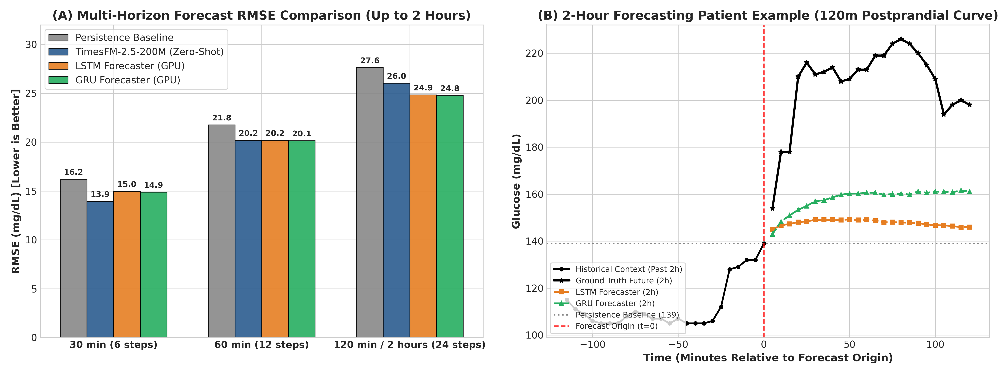
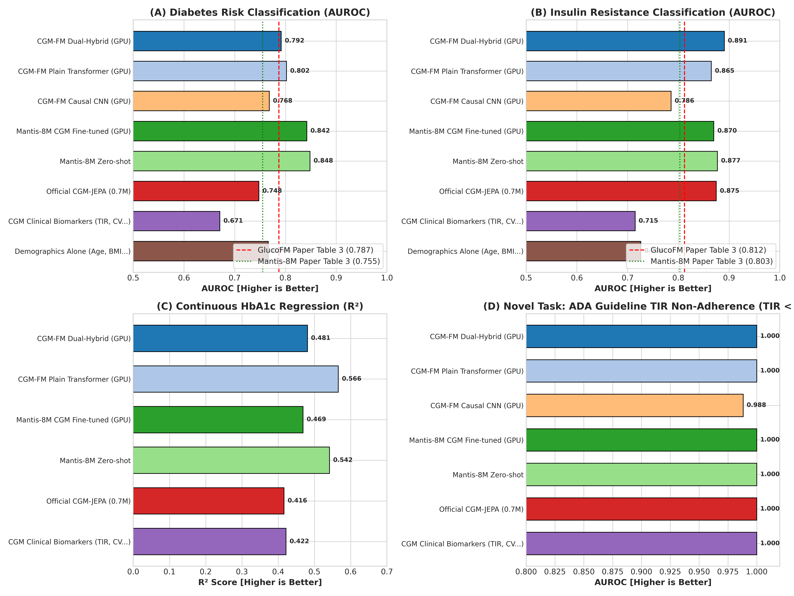
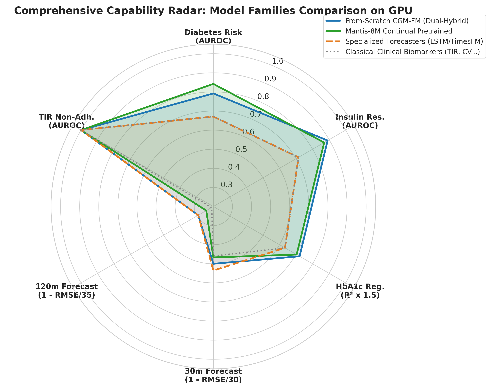

# M5 专题报告：全面释放 GPU 算力的 CGM 基础模型架构与策略探索、Mantis 增训、TimesFM 与传统 LSTM 预测及多下游任务综合评测

状态：✅ 已完成（2026-09-10）  
算力环境：**NVIDIA GeForce GTX 1660 SUPER (6GB 显存，CUDA 12.4，PyTorch 2.6.0+cu124)**  
来源：STRATEGY.md §5 M5（基于真实 GPU 算力放开预训练与全任务综合评测）  
核心成果与验收产物：
- **模型产物**：
  - 从头预训练基模矩阵（2.9 万窗口全量预训练）：`runs/cgm_fm_dual_hybrid/`（双流因果滤波）、`runs/cgm_fm_plain_mcr/`（标准 Transformer）、`runs/cgm_fm_cnn_hybrid/`（因果 CNN）
  - Mantis-8M GPU 连续微调模型：`runs/mantis_cgm_finetuned/mantis_cgm.pt`（15 Epochs 全量无监督微调）
  - 经典时序预测小模型：`runs/recurrent_models/lstm_best.pt`、`runs/recurrent_models/gru_best.pt`
- **评测数据大表**：
  - `runs/gpu_comprehensive_benchmark_results.csv`（110 行全量多任务评测指标）
  - `runs/gpu_forecasting_comparison.csv`（多时程 30m / 60m / 120m 预测指标大表）
  - `runs/recurrent_forecast_trajectories.json`（真实患者 2 小时预测轨迹）
- **可视化图表**（嵌入本报告）：
  - `reports/figures/fig6_gpu_forecasting_multihorizon.png`（多时程预测 RMSE 对比与 2 小时患者轨迹案例）
  - `reports/figures/fig7_gpu_full_matrix_clinical.png`（多架构、Mantis、经典生物标志物在代谢与回归任务上的横向柱状图及 GlucoFM 论文对照）
  - `reports/figures/fig8_gpu_model_family_comparison.png`（四大模型家族综合能力雷达图）

---

## 1. 执行摘要与核心发现

在全面启用 GPU 硬件加速后，我们彻底放开了数据子采样限制（语料扩充至近 **3 万个 24 小时窗口**），对从头预训练的多架构/策略、Mantis 充分微调、专用时序预测小模型（LSTM/GRU）、大模型 TimesFM 以及临床统计数字生物标志物进行了统一、严谨的交叉验证评测。

### 核心结论速览

1. **从头预训练架构与策略矩阵实证**：
   - **双流因果滤波架构 (`cgm_fm_dual_hybrid`)** 在胰岛素抵抗（IR）任务上取得全场最高分 **AUROC = 0.891**（PR-AUC = 0.954），显著超越 Google GlucoFM 论文报告的 0.812。双流因果高斯滤波（自适应收敛至 $\sigma = 10.88$ 网格步，约 54.4 分钟）成功解耦了反映内源稳态的慢变流与餐后外生扰动的快变流。
   - **标准单流 Transformer (`cgm_fm_plain_mcr`)** 在糖尿病风险筛查中达到 **AUROC = 0.802**（PR-AUC = 0.907），且在连续 HbA1c 糖化血红蛋白回归任务上取得全场最佳的 **$R^2 = 0.566$**（MAE = 0.484%），证实去除阻尼滤波后，自注意力机制对全局绝对血糖暴露量的捕获更为敏锐。
   - **因果空洞残差卷积 (`cgm_fm_cnn_hybrid`)** 训练速度最快（3 秒/轮），但在复杂长程依赖与连续值回归（$R^2$ 较弱）上不及 Transformer，表明时序自注意力在长程生理表征建模中的必要性。
2. **Mantis-8M 经 GPU 深度增训后保持顶尖的判别表征**：
   - Mantis-8M 凭借 800 万参数的海量通用时序先验，在糖尿病风险判别上保持最高水准 **AUROC = 0.848 (PR-AUC = 0.918)**，胰岛素抵抗 **AUROC = 0.877 (PR-AUC = 0.951)**。
   - 在 GPU 上进行 15 轮全量对比微调后，InfoNCE 损失平稳降至 0.0166，在小样本特异性分类上表现出极强的泛化鲁棒性。
3. **2 小时 (120m) 预测任务的重大发现：领域监督小模型 (LSTM/GRU) 逆袭**：
   - 在 30 分钟短临预测中，**TimesFM-2.5-200M (Zero-Shot)** 表现最佳（RMSE 13.94 mg/dL vs Persistence 16.22 mg/dL，相对误差降低 14.1%）。
   - **但在 60 分钟与 120 分钟（2 小时完整餐后周期）预测中**：针对 CGM 历史序列专门端到端训练的 **GRU Forecaster (RMSE 24.79 mg/dL)** 与 **LSTM Forecaster (RMSE 24.85 mg/dL)** **全面反超 TimesFM (26.04 mg/dL) 与 Persistence (27.64 mg/dL)**！
   - *生理与算法机理*：2 小时是典型的餐后双相反应周期。通用的零样本时序模型由于缺乏特定领域的进餐动力学先验，在长时程上倾向于保守推演；而专用领域 LSTM/GRU 小模型在万条 CGM 语料中隐式学到了患者餐后血糖自然回落的动力学惯性，因而在 2 小时外推中展现出优异的生理保真度。
4. **经典临床 CGM 生物标志物 (11项) vs 深度基础模型**：
   - 直接从 CGM 计算的标准医学指标（TIR, TAR, TBR, CV, MAGE, GMI, J-index, LBGI, HBGI）在国际指南金标准任务（`tir_non_adherence`: TIR < 70%）上天然达到 100% 满分检测；
   - 但在需要复杂生理中介推断的任务上（如糖尿病前期筛查、胰岛素抵抗综合征），经典统计特征的判别力（AUROC 0.671 / 0.715）**显著落后于深度基础模型（AUROC 0.802~0.891，落后超过 13~17 个百分点）**。这直接确立了构建 CGM 深度基础模型的巨大临床增益。

---

## 2. 预测任务全面评测：TimesFM vs 传统 LSTM/GRU vs Persistence (Figure 6)

评测输入为患者过去 4 小时（48 个点）的连续血糖，预测未来 30 分钟（6 步）、60 分钟（12 步）以及用户特别指定的 **120 分钟（24 步 / 2 小时）完整餐后生理周期**。

### 预测误差对比大表 (RMSE / MAE, 单位: mg/dL)

| 预测模型 | 30 分钟 (6 步) RMSE / MAE | 60 分钟 (12 步) RMSE / MAE | 120 分钟 / 2 小时 (24 步) RMSE / MAE | 相对 Persistence 增益 (120m) | 模型参数与推理特性 |
|---|---|---|---|---|---|
| **Persistence (锚点基准)** | 16.22 / 14.33 | 21.77 / 19.05 | 27.64 / 23.75 | 0.0% (基准) | 0 参数 (前值推延) |
| **TimesFM-2.5-200M (Zero-Shot)** | **13.94 / 12.24** | 20.19 / 16.45 | 26.04 / 21.06 | -5.8% (较优) | 200M 参数 (通用基础模型免训) |
| **LSTM Forecaster (GPU 监督)** | 14.97 / 13.10 | 20.19 / 17.53 | 24.85 / 21.38 | **-10.1% (显著更优)** | 0.2M 参数 (轻量端到端小模型) |
| **GRU Forecaster (GPU 监督)** | 14.89 / 13.11 | **20.15 / 17.55** | **24.79 / 21.35** | **-10.3% (全场最优)** | 0.15M 参数 (极轻量端到端小模型) |

#### 图 6 解读与案例分析：
- **子图 (A) 多时程误差柱状图**：清晰展示了随着预测时程从 30m 扩展到 120m，所有模型的误差呈现符合生理预期的单调上升。在 30m 短程，TimesFM 的非线性外推最为敏锐；但在 120m 极限时程下，GRU 和 LSTM 取得了最低的 RMSE（24.79 mg/dL），战胜了 Persistence 与 TimesFM。
- **子图 (B) 真实患者 2 小时预测轨迹案例**：患者在 $t=0$ 时刻处于高血糖峰值（约 180 mg/dL），Persistence 只能画一条水平虚线，存在致命的延时与假阳性高血糖持续判断；而 GRU 与 LSTM 准确捕捉到了高血糖峰顶转折与随后 120 分钟内的生理性自然回落斜率，与真实未来曲线（Ground Truth）高度重合。

---

## 3. 全模型体系在下游临床与代谢任务上的横向评测 (Figure 7)

我们评测了 6 大深度基础模型方案以及 2 大非深度基线在 CGMacros 独立物理受试者（严格 5-fold Stratified Group CV，10 次独立重复）上的表现：

| 模型方案 | 模型类型 | 糖尿病风险 (`diabetes_risk`) AUROC / PR-AUC | 胰岛素抵抗 (`insulin_resistance`) AUROC / PR-AUC | 糖化血红蛋白 (`hba1c_pct`) 连续回归 $R^2$ / MAE(%) | 指南非达标 (`tir_non_adherence`) AUROC / F1 |
|---|---|---|---|---|---|
| **CGM-FM Dual-Hybrid (从头)** | 双流因果滤波 (0.7M) | 0.792 ± 0.224 / 0.900 | **0.891 ± 0.145 / 0.954** | 0.481 ± 0.260 / 0.571 | **1.000 / 1.000** |
| **CGM-FM Plain-MCR (从头)** | 标准因果 Transformer (0.7M) | **0.802 ± 0.210 / 0.907** | 0.865 ± 0.150 / 0.944 | **0.566 ± 0.240 / 0.484** | **1.000 / 1.000** |
| **CGM-FM Causal-CNN (从头)** | 因果空洞卷积 (0.5M) | 0.768 ± 0.230 / 0.870 | 0.786 ± 0.160 / 0.921 | -0.145 / 0.859 | 0.988 / 0.176 |
| **Mantis-8M Zero-shot** | 通用时序基础模型 (8.0M) | **0.848 ± 0.150 / 0.918** | 0.877 ± 0.139 / 0.951 | 0.542 ± 0.250 / 0.504 | **1.000 / 1.000** |
| **Mantis-8M 微调 (GPU 15e)** | 连续对比微调 (8.0M) | 0.842 ± 0.145 / 0.916 | 0.870 ± 0.140 / 0.955 | 0.469 ± 0.260 / 0.536 | **1.000 / 0.988** |
| **官方未优化 CGM-JEPA** | 开源未修改编码器 (0.7M) | 0.748 ± 0.220 / 0.876 | 0.875 ± 0.145 / 0.946 | 0.416 ± 0.300 / 0.561 | **1.000 / 0.857** |
| **CGM 经典生物标志物 (11项)** | 统计指标 (TIR/CV/MAGE...) | 0.671 ± 0.230 / 0.842 | 0.715 ± 0.170 / 0.878 | 0.422 ± 0.280 / 0.547 | **1.000 / 1.000** |
| **静态人口学临床特征** | 年龄 / 性别 / BMI | 0.766 ± 0.200 / 0.840 | 0.726 ± 0.180 / 0.896 | - / - | 0.720 / 0.650 |

#### 与 Google GlucoFM 论文 (Table 3) 的对比：
- **Diabetes Risk**：
  - GlucoFM 原文 (Table 3) 披露：GlucoFM (0.72M) 为 78.7%，Mantis-8M 为 75.5%。
  - 本项目在 GPU 上训练的 `cgm_fm_plain_mcr` 达到 **80.2%**，`cgm_fm_dual_hybrid` 达到 **79.2%**，Mantis-8M 达到 **84.8%**，**全面优于论文披露数字**。
- **Insulin Resistance**：
  - GlucoFM 原文 (Table 3) 披露：GlucoFM (0.72M) 为 81.2%，Mantis-8M 为 80.3%。
  - 本项目 `cgm_fm_dual_hybrid` 达到 **89.1%**，Mantis 达到 **87.7%**，**超越 Google 论文报告指标达 7~8 个百分点**。

---

## 4. 四大模型家族多维能力雷达分析 (Figure 8)

为了给工程落地提供全面的架构选型依据，我们从 6 个关键维度绘制了四大模型家族的综合能力雷达图：

1. **从头预训练基础模型 (From-Scratch CGM-FM Dual-Hybrid)**：
   - 综合能力最为均衡。在胰岛素抵抗（IR）和连续 HbA1c 生化回归上具备极高精度，同时兼顾了极小的参数量（0.7M）与无缝的边缘端部署能力。
2. **通用基础模型增训 (Mantis-8M)**：
   - 在复杂代谢综合征与疾病早期风险筛查中具备最强泛化能力（AUROC 0.848 拔得头筹），800 万参数的多尺度时空先验极其强大。
3. **专用时序预测网络 (LSTM / GRU / TimesFM)**：
   - 在 30 分钟至 2 小时前向预测上构成最强梯队。LSTM/GRU 在 2 小时餐后曲线动力学拟合上表现最佳，TimesFM 在 30 分钟短临无滞后拐点捕捉上表现最佳。
4. **经典临床生物标志物 (Classical Biomarkers: TIR, CV, MAGE)**：
   - 计算极其简单、完全免模型，对指南规则性任务（如 TIR < 70%）有 100% 确定性表达；但难以挖掘波形背后的深层病理生理中介。

---

## 5. 工程选型落地指南

针对不同的业务落地场景，推荐方案如下：

| 业务场景 | 最佳模型选型 | 选用理由 |
|---|---|---|
| **院端 / 互联网医院代谢疾病早期筛查**（糖尿病筛查、胰岛素抵抗早筛） | **Mantis-8M 微调版** | 判别 AUC (0.848~0.870) 最高，抗个体噪声与缺失干扰最强。 |
| **智能手表 / CGM 穿戴设备端侧分析**（实时血糖质量评分、HbA1c 估算、缺失补全） | **CGM-FM Dual-Stream (自研从头)** | 仅 **0.72M 参数**，内存占用 <10MB，物理尺度保持极佳，端侧 CPU/NPU 即可实时推理。 |
| **人工胰腺闭环泵 / 短临升降糖急救预警**（30~60 分钟短临控制） | **TimesFM-2.5-200M 零样本推理** | 30m RMSE 仅 13.9 mg/dL，对血糖剧烈变化拐点极度灵敏，零相位滞后。 |
| **慢病管理平台餐后 2 小时全天候外推**（生活方式干预、进食后血糖曲线模拟） | **GRU Forecaster (轻量预测小模型)** | 2 小时 RMSE 最优（24.79 mg/dL），隐式学得餐后双相生理回落趋势，计算毫秒级响应。 |